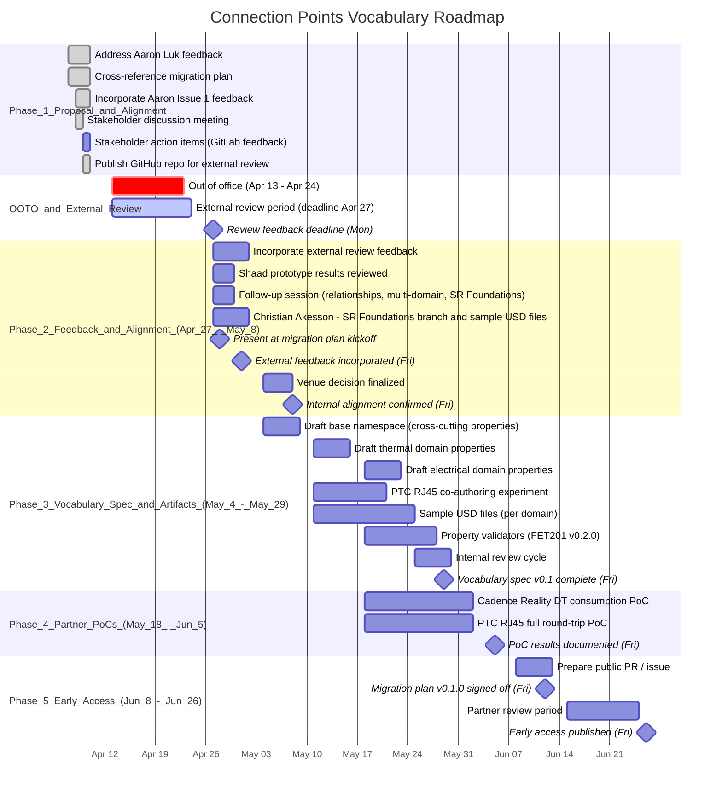

# Connection Points Vocabulary: Proposal-to-Delivery Roadmap

## Overview

This document defines the execution path from the
[Connection Points Proposal](AIF_Connection_Points_Proposal_Concise.md) through
internal and external alignment to a deliverable vocabulary specification,
targeting an **early-access publication on the
[SimReady Foundation](https://github.com/NVIDIA/simready-foundation) repo by
end of June 2026**.

The connection points vocabulary is the v0.2.0 evolution of FET201 (AIF
Connection Points), building on the v0.1.0 Foundation scaffolding established by
the [AIF-to-SimReady Foundation migration](https://gitlab-master.nvidia.com/bperschall/aif_simready_migration_plan).

### Stakeholder alignment status (Apr 8, 2026)

The [stakeholder meeting on Apr 8](#stakeholder-meeting-outcomes-apr-8) produced
broad alignment on the proposal direction. Key decisions are captured in the
[Stakeholder Meeting Outcomes](#stakeholder-meeting-outcomes-apr-8) section
below. The roadmap phases below reflect those decisions.

## Relationship to the AIF-to-SimReady Migration

The migration plan and this roadmap are **sequential, not competing**:

|                               | Migration Plan (v0.1.0)                                             | This Roadmap (v0.2.0)                                                   |
| ----------------------------- | ------------------------------------------------------------------- | ----------------------------------------------------------------------- |
| **What it does**              | Formalizes current AIF conventions into SimReady Foundation         | Evolves the architecture to Xform prims + `connectionPoint:` properties |
| **Deliverable**               | 19 requirements, 4 features (FET200-203), 4 profiles, 16 validators | Vocabulary specification, partner PoCs, early-access publication        |
| **Timeline**                  | 8 weeks, targeting Jun 12 sign-off                                  | 12 weeks, targeting Fri Jun 26 early access                             |
| **Foundation infrastructure** | Creates it (capability folders, FET201, profiles, validation.py)    | Depends on it existing; evolves FET201 requirements                     |

The migration plan builds the SimReady Foundation scaffolding this roadmap
needs. FET201 v0.1.0 requirements (CP.001-CP.006) validate today's assets and
establish the pattern for requirement versioning. FET201 v0.2.0 requirements
will add property-based checks alongside (and eventually replacing) the
naming-convention checks.

### EA artifact summary

The end-of-June early access publication delivers the following artifacts
alongside the vocabulary specification (see [Definition of Done](#definition-of-done)
for full acceptance criteria):

| #   | Artifact                     | EA scope                                                                 | Relationship to migration plan                         |
| --- | ---------------------------- | ------------------------------------------------------------------------ | ------------------------------------------------------ |
| 1   | Vocabulary Specification     | Full spec for base, thermal, electrical; property-list for other domains | Defines FET201 v0.2.0 property semantics               |
| 2   | Sample USD Files (4)         | Thermal, electrical, network, layered authoring                          | Reference implementations for v0.2.0 validators        |
| 3   | Property Validators (3)      | Standalone CP.010-CP.012 scripts                                         | Future integration into Foundation `validation.py`     |
| 4   | CAD/PLM Integration Workflow | Property tiers, layering walkthrough, partial population guidance        | Documents how CAD tools populate v0.2.0 properties     |
| 5   | Migration Guide              | Property mapping table, backward compatibility, conceptual walkthrough   | Bridges v0.1.0 naming conventions to v0.2.0 properties |
| 6   | PoC Results                  | At least one end-to-end partner PoC documented                           | Validates the v0.2.0 approach against real toolchains  |

## Timeline

---

## Phase 1: Proposal Strengthening & Stakeholder Alignment (Tue Apr 7 -- Fri Apr 10)

**Goal:** Make the proposal robust enough for external scrutiny, connect it
to the migration plan, get internal stakeholder alignment, and publish for
external review before OOTO.

**Deliverables:**

- Address Aaron Luk's three feedback items from
[Issue #1](https://gitlab-master.nvidia.com/bperschall/aif_connection_points/-/issues/1):
  - SimReady Foundation Capability/Feature/Profile mapping
  - Asset Structure Principles alignment with consumption workflows
  - Joint example with the identifiers proposal
- Incorporate Aaron Luk's Issue #1 feedback into the proposal
- Replace Cadence 6SigmaDCX reference with Cadence Reality DT
- Add cross-references to the AIF-to-SimReady migration plan
- Update Next Steps to reflect phased delivery
- Stakeholder discussion meeting (Apr 8) -- alignment reached on key
design decisions (see [outcomes below](#stakeholder-meeting-outcomes-apr-8))
- All stakeholders: review proposal and open questions on GitLab, raise
issues or comments ASAP
- Shaad Boochoon: prototype Jason Batchkoff's payload/feature layering
approach from the Isaac Sim side and share findings (due Mon Apr 27 --
**not a Phase 1 exit blocker**; findings feed into Phase 2 alignment)
- Publish GitHub repo for external partner review -- **Done (Apr 9).**
Repo: [https://github.com/bperschall/connection_points_proposal_draft](https://github.com/bperschall/connection_points_proposal_draft).
GitHub credentials for sharing with external partners pending.

**Exit criteria:** Stakeholder alignment confirmed on key design decisions.
GitHub repo published before OOTO for external review. (Shaad's prototype
is due upon return from OOTO, not before.)

### External review window (Apr 13-27)

The OOTO period doubles as the external review window. By publishing the
GitHub repo before Apr 13, stakeholders and external partners get two full
weeks to review, comment, and suggest changes without competing for Beau's
time.

- **Review period:** Apr 13 -- Apr 27 (Monday)
- **Feedback deadline:** Monday, Apr 27 (end of day)
- **What reviewers should do:** Open issues or comments on the GitHub repo
against the proposal and open questions documents
- **Feedback incorporation:** First week back (Mon Apr 27 -- Fri May 1) is
dedicated to incorporating review feedback -- this is a gated deliverable
before proceeding to Phase 3 spec drafting

---

## Stakeholder Meeting Outcomes (Apr 8)

The stakeholder discussion on Apr 8, 2026 produced the following alignment.
These decisions shape the remainder of the roadmap.

### Attendees

| Person            | Role                             |
| ----------------- | -------------------------------- |
| Beau Perschall    | Connection Points proposal lead  |
| Christian Akesson | AIF workflow specialist          |
| John Kosnik       | Robotics workflow specialist     |
| Chuan Fan         | SPT team (NVIDIA internal)       |
| Shaad Boochoon    | SimReady Foundations engineering |
| Jason Batchkoff   | SimReady Foundations Lead        |
| Alex Fuchs        | Customer Success                 |

> **Unable to attend but sent the recording and recap:** Aaron Luk (SimReady
> strategy / identifiers proposal), Max Bickley (AIF PM), Peter Bracewell
> (Datacenter engineering), Renato Gasoto (Robotics workflow specialist),
> Asmita Wankhede (SimReady Foundation PM). Scott Wallace, Frank DeLise,
> Jens Jebens, Kourosh Nemati, and Mike Tu were CC'd on the recap.

### Decisions reached

1. **Use-case-driven, domain-agnostic proposal** -- proceed with a layered,
  domain-agnostic design rather than an AIF-only solution. Datacenters are the
   immediate driver but the model should extend to robotics, manufacturing, and
   networking.
2. **Inheritance over divergence** -- favor extending existing USD constructs
  and inheriting from existing primitives rather than inventing parallel
   constructs. Terminology should converge with SimReady Foundations and
   Robotics ("connection points" vs. "attachment points" alignment needed).
3. **Single-prim, multi-domain modeling** -- real connectors that span multiple
  domains (e.g., mechanical + thermal + electrical) should be a single prim
   with multiple domain property prefixes, keeping connectors atomic and
   validation simpler.
4. **Layer-based separation as strong recommendation** -- connection point
  metadata should live in dedicated USD layers, not embedded in geometry. This
   enables independent updates and cleaner CAD regeneration. Strong SHOULD, not
   a hard MUST.
5. **Schema maturity progression** -- avoid jumping to rigid schemas. Allow
  progression from namespaced attributes -> applied schemas -> formal schemas
   as adoption matures.
6. **Incremental delivery and staged maturity** -- assets may progressively
  gain capabilities (e.g., electrical first, then thermal). Partial compliance
   is acceptable if it satisfies a valid use case. No "all-or-nothing"
   requirements.
7. **Namespace hygiene** -- clarity, discoverability, and validator-driven
  enforcement matter more than prescriptive naming alone. Avoid a "metadata
   junk drawer" in the base namespace.

### Action items

| Action                                                                                             | Owner             | Deadline       | Status |
| -------------------------------------------------------------------------------------------------- | ----------------- | -------------- | ------ |
| Review proposal + open questions on GitLab; raise issues ASAP                                      | All stakeholders  | Mon Apr 27     | Open   |
| Incorporate Aaron Luk's Issue #1 feedback into proposal                                            | Beau Perschall    | --             | Done   |
| Prototype Jason's payload/feature layering approach (Isaac Sim side)                               | Shaad Boochoon    | Mon Apr 27     | Open   |
| Create SimReady Foundations branch for this work; coordinate merge strategy                        | Christian Akesson | Mon Apr 27     | Open   |
| Publish GitHub repo for external review                                                            | Beau Perschall    | Done (Apr 9)   | Done   |
| External partners and stakeholders: broad review on GitHub (two-week window, Apr 13 -- Apr 27)     | All reviewers     | **Mon Apr 27** | Open   |
| Incorporate external review feedback into proposal                                                 | Beau Perschall    | Fri May 1      | Open   |
| Schedule follow-up session on relationships, multi-domain modeling, and SR Foundations integration | Beau Perschall    | Mon Apr 27     | Open   |

---

## Phase 2: Feedback Incorporation & Foundation Integration (Mon Apr 27 -- Fri May 8)

**Goal:** Incorporate the external review feedback collected during OOTO, close
remaining alignment gaps from the Apr 8 meeting, and prepare the Foundation
integration path.

> **Note:** The Apr 8 stakeholder meeting already produced alignment on the core
> design direction (see [outcomes above](#stakeholder-meeting-outcomes-apr-8)).
> Phase 2 starts with the feedback received during the two-week external review
> window, then addresses Foundation integration mechanics, terminology
> convergence, and the relationship/multi-domain deep-dive.

**Deliverables:**

### Week 1 (Mon Apr 27 -- Fri May 1): Feedback incorporation

- Triage all GitHub issues and comments received during the review period
(deadline was Apr 27)
- Incorporate accepted suggestions into the proposal and open questions
- Document rejected suggestions with rationale
- Publish updated proposal reflecting external feedback

### Weeks 1-2 (Mon Apr 27 -- Fri May 8): Alignment

- Follow-up session: go deeper on relationships, multi-domain modeling, and
SimReady Foundations integration (the three topics flagged for follow-up)
- Present the connection points evolution as part of the migration plan kickoff
(Apr 28), showing the v0.1.0 -> v0.2.0 arc
- Christian Akesson's SimReady Foundations branch created and merge strategy
agreed upon
- Brief read from Asmita Wankhede and Shaad Boochoon that FET201 versioning from
naming-convention requirements (v0.1.0) to property-based requirements
(v0.2.0) is consistent with how they expect the Foundation to evolve
- Shaad Boochoon's payload/feature layering prototype results reviewed
- Decision on publication venue:
  - **Recommendation: SimReady Foundation branch.** Publish the vocabulary
  specification on a dedicated branch of
  [NVIDIA/simready-foundation](https://github.com/NVIDIA/simready-foundation)
  while it is under active development. This keeps the work close to the
  Foundation infrastructure it depends on and avoids premature exposure in
  OpenUSD-proposals before the vocabulary has been validated by partner PoCs.
  - OpenUSD-proposals remains the long-term target once the vocabulary
  stabilizes post-GA and demonstrates cross-industry adoption beyond
  NVIDIA use cases.
- Terminology convergence decision: "connection points" vs. "attachment points"
across Foundations, AIF, and Robotics
- Aaron Luk alignment (via recording review and GitLab/GitHub feedback)

**Stakeholders:**

| Person               | Role                                     | What they approve                                                    |
| -------------------- | ---------------------------------------- | -------------------------------------------------------------------- |
| Aaron Luk            | SimReady strategy / identifiers proposal | Domain-agnostic scope; SimReady narrative; joint vocabulary approach |
| Asmita Wankhede      | SimReady Foundation PM                   | FET201 versioning approach; publication venue                        |
| Shaad Boochoon       | SimReady Foundations engineering         | Technical pattern for property-based requirements                    |
| Jason Batchkoff      | SimReady Foundations Lead                | Branch strategy; merge path for connection points work               |
| Christian Akesson    | AIF workflow specialist                  | SR Foundations branch creation; sample USD file authoring            |
| Steve Ghee           | PTC (external partner)                   | Discoverability and CAD export feasibility                           |
| Chuan Fan / SPT team | NVIDIA (internal)                        | Equipment models; RJ45 connection point export via PTC tools         |

**Exit criteria:** External review feedback incorporated (by Fri May 1). Publication
venue decided. SimReady Foundation branch created. Terminology convergence
agreed. Follow-up topics (relationships, multi-domain deep-dive) addressed.

---

## Phase 3: Vocabulary Specification & Supporting Artifacts (Mon May 4 -- Fri May 29)

**Goal:** Produce the concrete artifacts that external partners can react to:
the vocabulary specification document, sample USD files, and property
validators.

This phase produces the primary deliverables the proposal calls for, shaped by
the [stakeholder decisions](#stakeholder-meeting-outcomes-apr-8):
domain-agnostic scope, single-prim multi-domain modeling, schema maturity
progression, and use-case-driven requirements.

### Scope: thermal + electrical first

Start with the two domains where real AIF assets and active partner engagement
provide immediate validation. Network, mechanical, and airflow domains are
scoped for vocabulary completeness but detailed property tables are deferred.

### Specification contents

1. **Base `connectionPoint:` namespace** -- cross-cutting properties shared
  across all domains:
  - `connectionPoint:type` (token) -- thermal, electrical, airflow, network,
  mechanical
  - `connectionPoint:direction` (token) -- supply, return, intake, exhaust,
  bidirectional, input, output
  - `connectionPoint:system` (token) -- FWS, TCS, chilled_water, etc.
  - `connectionPoint:portDiameter` (float) -- interface diameter in stage
  units
  - `connectionPoint:matingDepth` (float) -- insertion depth
  - `connectionPoint:serviceClearance` (float) -- minimum access clearance
  - Additional cross-cutting mechanical properties (insertion force, keying,
  temperature rating, material)
2. **Axis convention** -- Z = connection direction (outward), Y = keying "up",
  X = right-hand rule. Referenced to ISO 9409-1 for mechanical interfaces.
3. **Thermal domain** (`connectionPoint:thermal:`) -- flowRate,
  designTemperature, operatingPressure, fluidType, flangeRating,
   disconnectType, allowedHoses
4. **Electrical domain** (`connectionPoint:electrical:`) -- voltage, current,
  phase, frequency, connectorType, redundancyGroup, allowedPowerWhips
5. **Multi-domain modeling** -- how a single prim carries properties from
  multiple domain prefixes (per stakeholder decision), including the
   `connectionPoint:domains` array pattern and validation implications
6. **Discovery mechanism** -- well-known `ConnectionPoints` scope prim +
  `connectionPoint:` property namespace queries as complementary mechanisms
7. **Composition model** -- how CAD-authored properties and PLM-authored
  properties layer through USD composition (layer-based separation as strong
   recommendation per stakeholder decision)
8. **Schema maturity progression** -- the path from namespaced attributes
  (v0.2.0) to applied schemas to formal schemas, with criteria for when
   promotion is warranted
9. **Migration from v0.1.0** -- how existing naming-convention assets coexist
  with property-based assets during transition

### PTC RJ45 co-authoring experiment (Mon May 11 -- Fri May 22)

A time-boxed, single-connection-point collaboration between the internal SPT
team (NVIDIA) and PTC (external partner) that runs in parallel with the
electrical domain drafting. This is spec validation, not the full PoC (which
remains in Phase 4).

- The SPT team uses PTC's CAD export tools to emit a single RJ45 network
connection point with draft `connectionPoint:` properties from the
spec-in-progress
- Output is either an SPT/PTC-validated `sample_network_connection.usda`
(stronger evidence than a hand-authored sample) or a prioritized list of
spec changes needed for the network domain
- **Fallback:** If PTC cannot deliver within the time box, Beau hand-authors
`sample_network_connection.usda` from the
[Q9 Open Questions](OPEN_QUESTIONS.md#q9-port-naming-and-hierarchy) example,
and the PTC-validated version becomes a Phase 4 deliverable
- Findings feed directly into the internal review cycle (week of May 25)
before the spec freezes on Fri May 29

**Owner:** Chuan Fan / SPT team (NVIDIA), with PTC support (coordination via Steve Ghee)

### Supporting artifacts produced in Phase 3

These artifacts accompany the specification and are described in detail in
[Definition of Done](#definition-of-done).

- **Sample USD files (4 EA)** -- thermal, electrical, network (SPT/PTC-validated
or hand-authored fallback), and layered authoring. Multi-domain and migration
samples deferred to post-EA.
- **Property validators (3 EA checks)** -- standalone CP.010-CP.012 scripts.
Foundation `validation.py` integration deferred to own branch post-EA.
- **CAD/PLM integration workflow** -- documented authoring tiers and layering
patterns (worked PoC example included if available by EA)

### Review cycle

- Internal review: Aaron Luk, Shaad Boochoon, Asmita Wankhede,
Jason Batchkoff, Christian Akesson
- Partner pre-review: PTC (Steve Ghee, external), SPT team (NVIDIA, internal),
Cadence Reality DT
- RJ45 co-authoring experiment results reviewed as part of the internal review cycle

**Exit criteria:** Vocabulary specification v0.1 document complete and reviewed
internally. Sample USD files and property validators functional. RJ45
co-authoring experiment completed or fallback sample hand-authored.

---

## Phase 4: Partner Proof-of-Concept (Mon May 18 -- Fri Jun 5)

**Goal:** Demonstrate that the vocabulary works with real assets and real
consumers.

### PoC 1: Cadence Reality DT consumption

- Take existing Vertiv CDU or CRAH connection point data
- Author as Xform + `connectionPoint:` properties (alongside existing geometry
  - naming conventions for backward compatibility)
- Demonstrate that Cadence Reality DT can consume thermal and airflow properties
directly, without external lookup tables or manual configuration
- Document the "before and after": what the tool currently requires vs. what
the structured properties provide

**Owner:** Beau Perschall + Cadence Reality DT integration team

### PoC 2: PTC RJ45 full round-trip validation

> **Prerequisite:** Phase 3's [RJ45 co-authoring experiment](#ptc-rj45-co-authoring-experiment-mon-may-11----fri-may-22)
> already validated that the SPT team (using PTC tools) can emit a single RJ45
> connection point with correct properties. Phase 4 builds on those results.

- Validate that the Xform + properties representation round-trips cleanly
through PTC's full CAD export pipeline (export -> edit -> re-export)
- Test with multiple network port types beyond the single RJ45 (e.g., OSFP,
SFP+) if SPT equipment models support them
- Document the "before and after" for the publication: what PTC's pipeline
currently produces vs. what the vocabulary-aware pipeline produces
- Capture any pipeline changes PTC required to support `connectionPoint:`
properties (informs the CAD/PLM integration workflow artifact)

**Owner:** Chuan Fan / SPT team (NVIDIA), with PTC support (coordination via Steve Ghee)

### PoC documentation

Both PoCs produce:

- Working USD assets with `connectionPoint:` properties
- A brief write-up of what worked, what didn't, and what the vocabulary
specification should change based on practical experience

**Exit criteria:** At least one PoC demonstrates end-to-end consumption. PoC
results documented and available for the public publication.

---

## Phase 5: Early Access Publication (Mon Jun 8 -- Fri Jun 26)

**Goal:** Publish the full artifact set on a public GitHub repository for
external review and partner engagement.

### Deliverables

All artifacts from the [Definition of Done](#definition-of-done) checklist,
prepared as a PR or Issue on the chosen public repo:

- Vocabulary specification document (from Phase 3)
- Sample USD files demonstrating each domain and multi-domain modeling
- Property validators (FET201 v0.2.0 checks)
- CAD/PLM integration workflow documentation
- Migration guide (v0.1.0 -> v0.2.0)
- PoC results and sample USD assets (from Phase 4) included as supporting
evidence
- Joint coordination with the identifiers proposal noted in the PR
- Cross-reference to the v0.1.0 Foundation baseline (migration plan delivers
by Jun 12)

### Publication timing

The migration plan targets Jun 12 for final sign-off (v0.1.0 Foundation
baseline merged). The early access vocabulary specification publishes shortly
after, showing the v0.2.0 evolution path. This timing demonstrates momentum:
v0.1.0 landed, v0.2.0 is already in partner review.

**"Early access" means:** the vocabulary specification is published for review
and feedback, not as a final standard. Property names and types may change
based on partner and community input. The specification is usable for
prototyping but not yet normative.

> **Spec freeze vs. PoC timing:** The vocabulary specification freezes at the
> end of Phase 3 (Fri May 29), but partner PoC results arrive during Phase 4
> (through Fri Jun 5). Any PoC findings that require spec changes will be
> documented as **known issues** in the EA publication rather than delaying
> the release. These known issues feed directly into the first post-EA
> revision cycle.

### External engagement

- PTC, Cadence Reality DT, and Dassault review the specification against their
toolchains
- Aaron Luk coordinates alignment with the identifiers proposal
- AOUSD/TAC engagement deferred to post-GA (vocabulary publishes on SRF
branch for EA, not OpenUSD-proposals)

**Exit criteria:** Public PR or branch published on SimReady Foundation with
the full artifact set. At least two external partners actively reviewing.
All "Definition of Done"
items satisfied or explicitly deferred with rationale.

---

## Definition of Done

This section defines what "done" looks like for the end-of-June early access
publication. Each artifact has acceptance criteria that must be satisfied (or
explicitly deferred with rationale) before publication. **Ownership** is
assigned per artifact so delivery does not depend on a single author.

| Artifact                        | Owner                                                                            | Supporting                                                |
| ------------------------------- | -------------------------------------------------------------------------------- | --------------------------------------------------------- |
| 1. Vocabulary Specification     | Beau Perschall                                                                   | Aaron Luk (review), Shaad Boochoon (review)               |
| 2. Sample USD Files             | Christian Akesson (thermal, electrical, layered); Chuan Fan / SPT team (network) | PTC (network export support)                              |
| 3. Property Validators          | Jason Batchkoff                                                                  | Beau Perschall (requirements), Christian Akesson (branch) |
| 4. CAD/PLM Integration Workflow | Beau Perschall                                                                   | SPT team / PTC (worked example input)                     |
| 5. Migration Guide              | Beau Perschall                                                                   | Aaron Luk (strategy review)                               |
| 6. PoC Results                  | Cadence Reality DT team (PoC 1); Chuan Fan / SPT team (PoC 2)                    | Beau Perschall (coordination)                             |

### Artifact 1: Vocabulary Specification Document

The core deliverable. A prose document defining the `connectionPoint:` property
namespace with enough precision that an independent implementor could author
conformant connection points.

**Acceptance criteria:**

- Base namespace properties fully defined (name, type, allowed values,
required vs. optional, SI unit)
- Thermal domain properties fully defined
- Electrical domain properties fully defined
- Network, mechanical, and airflow domains documented at property-list
level (detailed specification deferred)
- Multi-domain modeling pattern documented with examples
- Axis convention specified with reference to ISO 9409-1
- Discovery mechanism documented (scope prim + namespace queries)
- Composition/layering model documented (CAD-authored vs. PLM-authored
tiers)
- Schema maturity progression documented (attributes -> applied schemas ->
formal schemas)
- Migration path from v0.1.0 documented
- Reviewed by internal stakeholders (Aaron Luk, Shaad Boochoon,
Asmita Wankhede, Jason Batchkoff, Christian Akesson)

### Artifact 2: Sample USD Files

Working `.usda` files that demonstrate correct usage of the vocabulary. These
serve as reference implementations and test fixtures for validators.

**EA acceptance criteria (4 files):**

- `sample_thermal_connection.usda` -- GB300 rack thermal connection points
(FWS supply/return) with full base + thermal domain properties
- `sample_electrical_connection.usda` -- GB300 rack electrical connection
points (PDU input, busway tap) with full base + electrical domain properties
- `sample_network_connection.usda` -- RJ45 network port originated from the
Phase 3 co-authoring experiment (emitted by SPT team using PTC tools, not
hand-authored); demonstrates physical and logical naming separation
- `sample_layered_authoring.usda` -- demonstrates the CAD layer +
PLM layer composition pattern (two files sublayered together)
- All EA sample files load without errors in `usdview` / Omniverse Kit
- All EA sample files pass their corresponding validators

**Deferred to post-EA (GA):**

- `sample_multi_domain.usda` -- connector with properties from multiple
domains (e.g., mechanical + pneumatic + electrical tool changer). Deferred
because multi-domain modeling patterns require additional partner validation
before committing to a reference sample.
- `sample_migration_before_after.usda` -- v0.1.0 naming-convention alongside
v0.2.0 property-based connection points for the same asset. Deferred because
a conversion reference is more useful once v0.2.0 tooling is stable.

### Artifact 3: Property Validators

Python-based validation checks that verify connection point conformance. For
EA, validators are standalone scripts. Foundation `validation.py` integration
requires stakeholder approval and will live on its own branch post-EA.

**EA acceptance criteria (3 checks):**

- **CP.010: Connection point prim structure** -- validates that connection
point Xforms exist under a `ConnectionPoints` scope, have `guide` purpose,
and carry at least `connectionPoint:type` and `connectionPoint:direction`
- **CP.011: Base property completeness** -- validates that required base
namespace properties are present and have valid values for the declared type
- **CP.012: Domain property conformance** -- validates that domain-specific
properties match the declared `connectionPoint:type` (e.g., thermal
properties present when type is "thermal")
- Validators run against all EA sample USD files with zero errors
- Validators produce clear error messages identifying the failing prim,
property, and expected vs. actual values

**Deferred to post-EA (own branch, requires Foundation stakeholder approval):**

- **CP.013: Multi-domain consistency** -- deferred with `sample_multi_domain.usda`
- **CP.014: SI unit plausibility** -- deferred until plausible ranges are
validated by partner PoC data
- Integration into SimReady Foundation `validation.py` pattern

### Artifact 4: CAD/PLM Integration Workflow

Documentation that describes how the vocabulary fits into real authoring
pipelines. Addresses the CAD/PLM boundary questions from the stakeholder
discussion. Foundation integration is deferred until after EA.

**EA acceptance criteria:**

- Property tier table: which properties are CAD-authored, PLM-authored,
or either (based on the tiers defined in
[Q8 of Open Questions](OPEN_QUESTIONS.md#q8-cadplm-integration-boundaries))
- Layered authoring walkthrough: step-by-step description of how a CAD
tool exports connection points to a `_ConnectionPoints.usd` layer and how
a PLM integration adds engineering properties in a stronger layer
- Partial population guidance: what constitutes a valid "CAD-only"
connection point vs. a fully-specified one, and how validators handle each

**Deferred to post-EA:**

- Worked example from a PoC (Cadence Reality DT or SPT/PTC) showing the
before/after of the integration workflow. If PoC results are available
before the EA publication date, they will be included; otherwise they ship
as a supplement.

### Artifact 5: Migration Guide

Practical guidance for understanding the mapping from v0.1.0 assets (geometry +
naming conventions) to v0.2.0 (Xform + properties).

**EA acceptance criteria:**

- Property mapping table: old naming convention elements -> new property
values (e.g., `_fws` in name -> `connectionPoint:system = "FWS"`)
- Backward compatibility guarantees documented (both formats coexist,
no flag day)
- Conceptual walkthrough of the conversion steps (prose, not tooling)

**Deferred to GA:**

- Automated conversion tooling (v0.1.0 -> v0.2.0 script). The vocabulary is
likely to evolve based on EA feedback, so investing in tooling now risks
rework.
- Real asset conversion demonstration (GB300 rack or Vertiv CDU) -- depends
on stable tooling above

### Artifact 6: PoC Results

Documentation of partner proof-of-concept outcomes that validate the
vocabulary against real toolchains.

**Acceptance criteria:**

- At least one PoC demonstrates end-to-end consumption (Cadence Reality DT
or SPT team via PTC tools)
- Working USD assets from the PoC included in the sample files
- Write-up of what worked, what didn't, and what the vocabulary
specification should change based on practical experience
- "Before and after" comparison: what the tool currently requires vs.
what the structured properties provide
- Any spec changes required by PoC findings documented as **known issues**
in the EA publication (see [publication timing](#publication-timing))

> **Note:** If partner PoCs are delayed, the specification and other artifacts
> publish based on internal validation only. PoC results are added as a
> follow-up when available (see [Risk Mitigation](#risk-mitigation)).

---

## Beyond June: Post-EA and GA Roadmap

> This phase is out of scope for the end-of-June EA deliverable but is
> documented here to show the full arc and capture items explicitly deferred
> from EA.

### Deferred EA items (target: GA)

These were scoped out of EA to keep the delivery realistic. They should be
the first priority after EA publication:

1. **Foundation `validation.py` integration** -- port EA standalone validators
  (CP.010-CP.012) into the SimReady Foundation pattern. Requires its own
   branch and stakeholder approval from Jason Batchkoff / Christian Akesson.
2. **CP.013 + CP.014 validators** -- multi-domain consistency and SI unit
  plausibility checks, deferred until `sample_multi_domain.usda` and
   partner PoC data are available.
3. `**sample_multi_domain.usda`** -- multi-domain reference sample, pending
  partner validation of the single-prim multi-domain pattern.
4. `**sample_migration_before_after.usda**` -- v0.1.0 / v0.2.0 side-by-side,
  more useful once conversion tooling is stable.
5. **Automated migration tooling** -- v0.1.0 -> v0.2.0 conversion script
  with real asset demonstrations (GB300 rack or Vertiv CDU).

### Longer-term (post-GA)

1. **New FET201 v0.2.0 requirements** -- property-based checks for
  `connectionPoint:` namespace presence, type validity, required properties
   per domain
2. **Evolved cross-domain validators** -- TC.002 and EL.004 evolve from
  name-pattern matching to property queries
3. **v0.1.0 deprecation** -- naming-convention requirements (CP.002, CP.004)
  marked as deprecated once tooling has migrated; v0.1.0 assets remain valid
   during transition
4. **Schema promotion evaluation** -- if adoption warrants, promote the
  `connectionPoint:` namespace to a formal applied API schema
   (`ConnectionPointAPI`)

---

## Risk Mitigation

| Risk                                                 | Impact                                                                                          | Mitigation                                                                                                                                                                                                                                                                                           |
| ---------------------------------------------------- | ----------------------------------------------------------------------------------------------- | ---------------------------------------------------------------------------------------------------------------------------------------------------------------------------------------------------------------------------------------------------------------------------------------------------- |
| **Partner PoCs delayed**                             | No external evidence for the early access publication                                           | Publish vocabulary specification based on internal validation only; add PoC results as a follow-up when available. The specification is valuable even without PoC results.                                                                                                                           |
| **Terminology convergence stalls**                   | "Connection points" vs. "attachment points" fragmentation across Foundations, AIF, and Robotics | Escalate to Aaron Luk in Phase 2 follow-up. Worst case: use "connection point" for v0.2.0 with a documented alias mapping if Robotics uses different terms.                                                                                                                                          |
| **Vocabulary scope creep**                           | Specification expands beyond what can be validated in the timeframe                             | Strict scoping to thermal + electrical domains. Network, mechanical, and airflow are documented at property-list level but not fully specified until partner PoCs cover them.                                                                                                                        |
| **Multi-domain modeling complexity**                 | Single-prim multi-domain approach proves harder to validate than expected                       | The stakeholder decision favors single-prim but the follow-up session will stress-test this. Fallback to co-located prims is documented in [Q2 of Open Questions](OPEN_QUESTIONS.md#q2-multi-domain-connection-points).                                                                              |
| **Shaad's prototype reveals schema incompatibility** | Isaac Sim's payload/feature layering conflicts with the proposed namespace approach             | The schema maturity progression (attributes -> applied schemas -> formal schemas) gives room to adjust. Prototype findings feed into Phase 3 spec drafting.                                                                                                                                          |
| **Migration plan v0.1.0 delayed**                    | The v0.1.0 baseline isn't available to reference at early access publication                    | The vocabulary specification is not blocked by v0.1.0 delivery. It references v0.1.0 as the baseline but can publish independently. The timing alignment is desirable, not mandatory.                                                                                                                |
| **Gap between v0.1.0 and v0.2.0 messaging**          | Stakeholders question why v0.1.0 requirements exist if v0.2.0 will replace them                 | Explicit framing: v0.1.0 validates today's assets and proves the Foundation model works for AIF. v0.2.0 evolves the architecture for CAD-export automation and cross-industry generalization. Both are necessary steps.                                                                              |
| **RJ45 co-authoring experiment delayed**             | SPT/PTC cannot deliver `sample_network_connection.usda` within the Phase 3 time box             | Explicit fallback: Beau hand-authors the network sample from the Open Questions Q9 example. The SPT/PTC-validated version becomes a Phase 4 deliverable instead.                                                                                                                                     |
| **Definition of Done artifacts incomplete by June**  | Not all six artifact categories are ready for publication                                       | Prioritize in order: (1) vocabulary spec, (2) sample USD files (4 EA), (3) validators (3 EA checks), (4) CAD/PLM workflow, (5) migration guide, (6) PoC results. Artifacts 1-3 are the minimum viable publication. Deferred items are tracked in [Beyond June](#beyond-june-post-ea-and-ga-roadmap). |

---

## Milestone Summary

| Date                     | Milestone                                                                                             |
| ------------------------ | ----------------------------------------------------------------------------------------------------- |
| Wed Apr 8 (done)         | Stakeholder discussion meeting -- alignment reached ([outcomes](#stakeholder-meeting-outcomes-apr-8)) |
| Fri Apr 10               | GitHub repo published for external review                                                             |
| Mon Apr 13 -- Fri Apr 24 | OOTO; external review window runs through Mon Apr 27                                                  |
| **Mon Apr 27**           | **External review feedback deadline; first day back**                                                 |
| Tue Apr 28               | Connection points evolution presented at migration plan kickoff                                       |
| Fri May 1                | External review feedback incorporated into proposal                                                   |
| Fri May 8                | Internal alignment confirmed; publication venue decided; terminology converged                        |
| Fri May 29               | Vocabulary specification v0.1 complete + sample USD files + validators (internal review done)         |
| Fri Jun 5                | Partner PoC results documented                                                                        |
| Fri Jun 12               | Migration plan v0.1.0 signed off (Foundation baseline landed)                                         |
| Fri Jun 26               | **Early access: full artifact set published** (see [Definition of Done](#definition-of-done))         |

