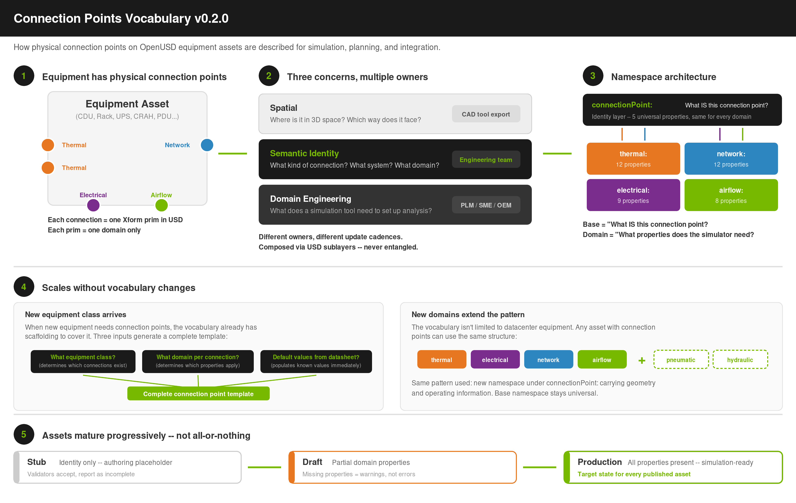

# Connection Points Vocabulary Specification v0.2.0

Copyright &copy; 2026, NVIDIA Corporation, version 0.2.0 (DRAFT), May 12, 2026

Beau Perschall

**Vocabulary feedback deadline: May 29, 2026**

> **Quick reference for implementers and AI agents:** See
> [Appendix A](#appendix-a-quick-reference-for-implementers-and-ai-agents)
> at the end of this document for a condensed rule set and common mistakes
> checklist.

---

**See also:**
- [CDU Exemplar](CDU_CONNECTION_POINTS_VOCABULARY.md) -- Coolant Distribution Unit (thermal-dominant)
- [Compute Rack Exemplar](COMPUTE_RACK_CONNECTION_POINTS_VOCABULARY.md) -- GB300 NVL72 (network-dominant)
- [UPS Exemplar](UPS_CONNECTION_POINTS_VOCABULARY.md) -- Uninterruptible Power Supply (electrical-dominant)
- [Connection Points Proposal](../AIF_Connection_Points_Proposal_Concise.md) -- Design rationale and problem statement
- [Open Questions](../OPEN_QUESTIONS.md) -- Resolved and open design questions

---

## Purpose

This document defines the vocabulary -- the property names, types, and
structural rules -- for describing physical connection points on OpenUSD
equipment assets. It is the normative reference for asset authors, CAD export
tool developers, and simulation tool consumers.

The vocabulary is grounded in the decisions from the April 8 stakeholder
meeting, April 28 Part 2 session, and subsequent partner feedback:

- Co-located single-domain prims (Option B: each connection = one Xform, one domain)
- Layer-based separation (connection metadata in its own sublayer)
- SI units at neutral level (meters, kg, Pascals, watts, liters/second)
- Schema maturity: namespaced attributes first, formal applied API schemas later
- Celsius for temperature (SI derived unit; practical standard across the domain)
- Pascals for pressure (SI base unit; no unit annotation property needed)

Per-class exemplar documents demonstrate the vocabulary applied to specific
equipment types. The CDU exemplar exercises the thermal domain heavily; the
compute rack exemplar exercises the network domain; the UPS exemplar exercises
the electrical domain. Together they demonstrate that the vocabulary
generalizes across fundamentally different connection profiles.



*Figure 1: The vocabulary in three ideas. (1) Each physical connection is one
Xform prim carrying one domain. (2) Spatial, semantic, and engineering concerns
live in separate layers with different owners and update cadences. (3) The
namespace architecture -- a shared base plus per-domain extensions -- scales to
new equipment classes and new domains without vocabulary changes.*

---

## Use cases driving property selection

Every property in the vocabulary exists because at least one downstream use case
requires it. This section documents the three primary use cases identified
through stakeholder feedback and maps each domain property to the use cases it
serves. Properties that do not trace to at least one use case should be
challenged or deferred.

### Use case 1: Thermal and performance simulation

Simulation ISVs consume connection point metadata to configure boundary
conditions. They need flow rates, temperatures, pressures, and fluid types to
set up thermal and electrical loops without manual configuration. The vocabulary
is designed so that any thermal, electrical, or CFD simulation tool -- current
or future -- can consume these properties as structured input rather than
relying on external lookup tables or manual operator configuration.

**Initial properties driven by this use case:** `designFlowRate`,
`maxFlowRate`, `designTemperature`, `maxTemperature`, `operatingPressure`,
`maxPressure`, `fluidType`, `nominalVoltage`, `maxCurrent`, `phases`,
`frequency`, `ratedPower`, `powerFactor`, `ventArea`, `designAirflow`,
`maxAirflow`, `designDeltaT`, `staticPressure`.

### Use case 2: Robotic assembly in datacenter operations

As datacenter operations scale, robotic systems will increasingly handle
physical assembly tasks -- installing trays, mounting racks, routing cables,
and connecting fluid lines. These systems need to know how connections
physically mate: insertion direction (from the Xform orientation), engagement
depth, disconnect mechanism, clearance envelope for tooling access, and
physical connector geometry. The same properties support maintenance sequence
planning and collision avoidance in digital twin rehearsal.

**Initial properties driven by this use case:** `matingDepth`,
`disconnectType`, `serviceClearance`, `portDiameter`, `flangeRating`,
`flangeSize`, `connectorType`.

### Use case 3: Assembly calculations and BOM generation

Facilities teams need connection point data for cable and pipe run calculations
(linear footage), bill of materials generation, and procurement. Port types,
connector standards, and physical dimensions feed directly into takeoff tools
and procurement systems.

**Initial properties driven by this use case:** `portDiameter`,
`flangeRating`, `flangeSize`, `connectorType`, `portType`, `lineRate`,
`matingDepth` (for cable length BOM calculations).

### Cross-cutting properties

Some properties serve multiple use cases: `matingDepth` supports both robotic
assembly (insertion planning) and BOM calculations (cable length). `portDiameter`
serves both simulation (flow area) and assembly (pipe specification). The base
namespace properties (`domain`, `direction`, `system`, `disconnectType`,
`serviceClearance`) are consumed by all three use cases for discovery, filtering,
and spatial reasoning.

---

## Generalization and extensibility

### Beyond datacenter equipment

The exemplars in this specification are grounded in datacenter equipment (CDUs,
compute racks, UPS units) because that is the immediate use case driving the
vocabulary. However, the vocabulary pattern is designed to generalize beyond
this domain. The structural elements -- three-layer separation of concerns,
base namespace for semantic identity, domain-specific namespaces for
engineering parameters, sublayer composition model -- do not assume datacenter
equipment. Any physical asset with connection points that need to be described
for simulation, planning, or integration purposes can use the same pattern.

A robotic workcell could define `simready:connectionPoint:pneumatic:` with properties
for operating pressure, thread type, and flow capacity. A manufacturing
facility's HVAC system could use `simready:connectionPoint:thermal:` and
`simready:connectionPoint:airflow:` with the same property definitions used here. An EV
charging station could extend `simready:connectionPoint:electrical:` with DC fast-charge
properties. Each new domain follows the same structural pattern: a namespace
under `simready:connectionPoint:` carrying physical geometry and operating parameter
properties.

The base namespace properties (`domain`, `direction`, `system`,
`disconnectType`, `serviceClearance`) are intentionally universal. They answer
the same questions regardless of industry or equipment type: what domain does
this connection belong to, which way does it flow, what system is it part of,
how does it physically disconnect, and how much room is needed to service it.

### Minimal valid connection points

The exemplars show fully dressed connections with every domain property
populated. This is the end state for a production asset, not the starting
point. A minimal valid connection point requires only the base namespace
properties plus the relevant domain namespace properties that the asset author
has data for. Properties can be populated incrementally as engineering data
becomes available from datasheets, PLM systems, or SME input.

For example, a connection point could initially carry only semantic identity
as an authoring stub:

```
simready:connectionPoint:domain = "thermal"
simready:connectionPoint:direction = "supply"
simready:connectionPoint:system = "FWS"
simready:connectionPoint:disconnectType = "flanged"
simready:connectionPoint:serviceClearance = 0.3
```

And be progressively enriched with thermal domain properties as the data
pipeline matures. This allows assets to enter the ecosystem with partial
metadata and improve over time, rather than requiring a complete dataset
before the connection point can be authored.

**Validation profiles:** To reconcile progressive enrichment with the property
completeness principle (which requires all domain properties to be present),
the vocabulary distinguishes three validation levels:

- **Stub** -- The connection point carries all five base namespace properties
  but no domain namespace properties. This is an authoring placeholder that
  establishes a connection's semantic identity before engineering data is
  available. Validators accept stubs as structurally valid but report them
  as incomplete.
- **Draft** -- The connection point carries all five base namespace properties
  and at least one domain namespace property. Missing domain properties are
  permitted; validators flag them as warnings, not errors. This profile is
  appropriate for assets entering the pipeline where engineering data is
  still being collected.
- **Production** -- The connection point carries all base namespace properties
  and all domain namespace properties defined for its domain. No domain
  property may be omitted. This profile is the target state for assets
  published to the SimReady catalog or consumed by simulation tools.

The completeness principle applies to the production profile. Asset authors
and tooling pipelines use stub and draft profiles to unblock early
integration, with the understanding that a connection point must reach
production completeness before it is considered simulation-ready. Validators
should report which profile a given asset satisfies.

### Connection point templates

The domain namespace structure is designed to support per-class connection
point templates, analogous to the metadata templates used today for
`aif:spec:` properties. A template defines the expected set of properties for
a given equipment class and connection type; the asset author populates the
values for their specific equipment.

Because every thermal connection needs the same set of thermal domain
properties regardless of whether it is on a CDU, a CRAH, or a heat exchanger,
the domain namespace itself serves as the template schema. Equipment-level
variation shows up in which connections an asset has and what values they
carry, not in which properties are needed per connection. A template generator
can produce a connection point scaffold from just three inputs: the equipment
class (which determines what connections exist), the domain of each connection
(which determines which namespace properties to include), and any known
default values from the equipment datasheet.

This approach scales naturally as new equipment classes are onboarded. When
Vertiv delivers a new Condenser asset class, the connection point template is
derived from the domains its connections span (likely thermal + electrical +
airflow), not from a bespoke property list that must be hand-curated for each
new class.

---

## Separation of concerns

Every connection point has three layers of concern. Each vocabulary property
belongs to exactly one layer. This separation governs where data originates,
who owns it, and how it flows into the USD asset through composition.

| Layer | What it captures | Who provides it |
|-------|-----------------|-----------------|
| **Spatial** | Physical location and orientation of the connection | CAD tool (Creo, NX, SolidWorks) via export |
| **Semantic identity** | What kind of connection this is, which direction it flows, what system it belongs to | Engineering team during asset authoring; stable across variants |
| **Domain-specific engineering** | Operating parameters AND physical connection geometry that a simulation tool needs | PLM system, equipment datasheets, or SME input |

The vocabulary covers the semantic and engineering layers. Spatial data (the
Xform's position and orientation) is defined by the CAD export and is not part
of the property namespace.

### Spatial orientation vs semantic direction

The Xform's transform (position and rotation) describes where the connection
is in 3D space and which way its physical opening faces. This is a spatial
concern owned by the CAD tool. The vocabulary property `simready:connectionPoint:direction`
is semantic: it describes the logical role of the connection within its system
(supply vs return, input vs output). Two connections may have identical
physical orientations (e.g., two pipes pointing out the back of a CDU) but
opposite semantic directions (one is supply, the other is return). A simulation
tool needs both: the Xform tells it where to attach and which way to aim; the
direction property tells it which way the system model flows.

---

## Base namespace: semantic identity

The base `simready:connectionPoint:` namespace carries only semantic identity -- the
properties that answer "what IS this connection?" without describing its
physical characteristics or operating parameters. These properties are
universal across all domains and connection types.

**Open vocabulary principle:** The token values listed in all property tables
throughout this document are representative examples drawn from current
equipment classes, not closed enumerations. New equipment classes, new OEM
partners, and new deployment contexts will surface values not listed here.
Validators should treat these lists as known-good examples, not as the
exhaustive set of allowed values. Formal value-set constraints, if needed, are
a future concern to be addressed alongside schema promotion.

| Property | Type | Example values | Description |
|----------|------|---------------|-------------|
| `simready:connectionPoint:domain` | token | `thermal`, `electrical`, `network`, `airflow`, `mechanical`, `pneumatic` | The physical domain of this connection |
| `simready:connectionPoint:direction` | token | `supply`, `return`, `input`, `output`, `bidirectional` | Flow or signal direction |
| `simready:connectionPoint:system` | token | e.g. `FWS`, `TCS`, `power`, `BMS`, `high_speed_data`, `mgmt`, `equipment_cooling` | System classification within the facility |
| `simready:connectionPoint:disconnectType` | token | e.g. `flanged`, `quick_disconnect`, `hardwired`, `RJ45`, `OSFP`, `blind_mate`, `open_vent` | Physical disconnect mechanism |
| `simready:connectionPoint:serviceClearance` | float (meters) | positive float | Minimum unobstructed clearance envelope around this connection, measured as the shortest distance from the connection interface to any obstruction that would prevent service access |

**Migration note (`simready:connectionPoint:type` to `simready:connectionPoint:domain`):**
Earlier drafts of this specification and some pre-release exemplars used the
property name `simready:connectionPoint:type` for the domain identifier. That property
has been renamed to `simready:connectionPoint:domain` to align with the terminology
used throughout the specification. Validators should treat
`simready:connectionPoint:type` as a deprecated alias: flag it as a warning and, where
tooling supports it, automatically map it to `simready:connectionPoint:domain`. Asset
authors should update existing assets to use `simready:connectionPoint:domain`; the old
property name will not be supported in future schema promotions.

**Open token validator behavior:** The open vocabulary principle means that
unknown token values (values not listed in the example columns above) are
never validation errors. Validators should emit informational or warning-level
diagnostics for unrecognized tokens to aid authoring review, but must not
reject assets on that basis alone. A future vocabulary revision or validation
profile may introduce closed value sets for specific properties; until then,
all token properties are open.

**Human-readable naming (SG-E4):** USD prim names are constrained by character
restrictions (no spaces, limited special characters). Authors SHOULD set the
built-in USD `displayName` metadata on connection point prims to provide
human-readable labels -- for example, `displayName = "Facility Water Supply --
Primary"`. The `displayName` metadata is already supported by most USD viewers
and handles localization natively. No custom vocabulary property is needed for
this purpose.

### Why physical geometry is NOT in the base namespace

Physical connection geometry (port dimensions, mating depth) lives in
domain-specific namespaces because these properties differ in meaning and shape
across domains:

| Domain | Port dimension | Mating depth |
|--------|---------------|--------------|
| Thermal | `thermal:portDiameter` (circular) | `thermal:matingDepth` (flange engagement) |
| Electrical | Absent for hardwired; future plug types may add | `electrical:matingDepth` (0.0 for hardwired) |
| Network | `network:portWidth` + `network:portHeight` (rectangular) | `network:matingDepth` (plug insertion depth) |

**Property completeness principle:** Every property defined in a domain
namespace should be present on every connection of that domain, even when the
value is zero or not physically meaningful (e.g., `matingDepth = 0.0` for a
hardwired electrical connection). Omitting a property forces validators and
consumers to distinguish "absent because not applicable" from "absent because
the author forgot," which adds unnecessary complexity. Setting a value to zero
is an explicit statement; omission is ambiguous.

Placing these in the base namespace would force a universal shape onto concepts
that are fundamentally domain-specific, or require consumers to know which base
properties apply to which domain. By keeping the base namespace clean, every
property in `simready:connectionPoint:` applies to every connection, no exceptions.

`serviceClearance` is the one property kept in the base namespace that could
arguably be domain-specific. Every connection needs a maintenance access
envelope regardless of domain, and the concept does not change shape -- it is
always "how much room do I need around this connection to work on it."

---

## Domain namespaces

Each domain namespace carries two kinds of properties:

1. **Physical connection geometry** -- dimensions, mating characteristics, and
   interface specifications for this type of connection
2. **Operating parameters** -- the engineering data a simulation tool needs to
   set up an analysis

### Thermal domain (`simready:connectionPoint:thermal:`)

For fluid connections (cooling loops, condensate, chilled water).

> **Naming note (SG-E1):** In datacenter contexts, "thermal" refers specifically
> to *liquid-cooled thermal* connections -- piped fluid loops carrying heat away
> from equipment. Gas-phase thermal cooling (air moving over equipment) is covered
> by the separate `simready:connectionPoint:airflow:` domain. This naming reflects how
> datacenter engineering teams segment their work: liquid cooling teams own the
> thermal domain, while airflow/CFD teams own the airflow domain. Adjacent
> industries (manufacturing, robotics) with hydraulic or chemical fluid connections
> would follow the same structural pattern using the `simready:connectionPoint:thermal:`
> namespace for fluid-based connections, or introduce new domain namespaces
> (e.g. `simready:connectionPoint:hydraulic:`) if the property set diverges significantly.

| Property | Type | Description |
|----------|------|-------------|
| `simready:connectionPoint:thermal:portDiameter` | float (meters) | Internal pipe diameter |
| `simready:connectionPoint:thermal:matingDepth` | float (meters) | Flange engagement or coupling insertion depth |
| `simready:connectionPoint:thermal:designFlowRate` | float (L/s) | Nominal operating flow rate |
| `simready:connectionPoint:thermal:maxFlowRate` | float (L/s) | Rated maximum flow rate |
| `simready:connectionPoint:thermal:designTemperature` | float (Celsius) | Nominal operating temperature at this connection |
| `simready:connectionPoint:thermal:maxTemperature` | float (Celsius) | Rated temperature limit |
| `simready:connectionPoint:thermal:operatingPressure` | float (Pa) | Nominal operating pressure |
| `simready:connectionPoint:thermal:maxPressure` | float (Pa) | Rated pressure limit |
| `simready:connectionPoint:thermal:fluidType` | token | Working fluid in the loop. Use descriptive tokens that encode concentration where relevant (e.g. `water`, `glycol_water_30`, `glycol_water_50`, `refrigerant_R410A`, `refrigerant_R134a`). See "Fluid type tokens" below. |
| `simready:connectionPoint:thermal:flangeRating` | token | Flange standard designation (e.g. `ANSI_150`) |
| `simready:connectionPoint:thermal:flangeSize` | token | Nominal pipe size designation (e.g. `NPS4`) |

**Fluid type tokens:** The `fluidType` property uses a single descriptive token
rather than separate fluid-type and concentration properties. This simplification
was adopted based on stakeholder feedback that emerging refrigerant cocktails make
concentration a poor standalone property -- the fluid name itself is the
meaningful identifier for simulation tool lookup. Recommended tokens:

| Token | Description |
|-------|-------------|
| `water` | Plain water (no glycol) |
| `glycol_water_30` | 30% propylene glycol / water mix |
| `glycol_water_50` | 50% propylene glycol / water mix |
| `refrigerant_R410A` | R-410A refrigerant |
| `refrigerant_R134a` | R-134a refrigerant |
| `refrigerant_R454B` | R-454B (low-GWP replacement for R-410A) |
| `dielectric` | Dielectric coolant (immersion cooling) |

This list is extensible. Asset authors may introduce new tokens following the
pattern `{fluid_category}_{specifier}`. Validators should accept unknown tokens
with a warning rather than rejecting them, to allow for emerging fluid types
without requiring vocabulary revisions.

### Electrical domain (`simready:connectionPoint:electrical:`)

For power connections (mains feeds, PDU outputs, UPS bypass).

| Property | Type | Description |
|----------|------|-------------|
| `simready:connectionPoint:electrical:matingDepth` | float (meters) | Plug insertion depth; set to 0.0 for hardwired connections |
| `simready:connectionPoint:electrical:nominalVoltage` | float (V) | Site-specific nominal voltage |
| `simready:connectionPoint:electrical:maxCurrent` | float (A) | Rated maximum current draw |
| `simready:connectionPoint:electrical:phases` | int | Number of phases (typically 3 for datacenter equipment) |
| `simready:connectionPoint:electrical:frequency` | float (Hz) | Line frequency (50 or 60 Hz, site-specific) |
| `simready:connectionPoint:electrical:connectorType` | token | Physical connection method (e.g. `hardwired`, `IEC_60309`, `NEMA_L21_30`) |
| `simready:connectionPoint:electrical:ratedPower` | float (W) | Rated power capacity of this connection (e.g. UPS output feed capacity) |
| `simready:connectionPoint:electrical:breakerRating` | float (A) | Upstream breaker protection rating |
| `simready:connectionPoint:electrical:powerFactor` | float (0-1) | Manufacturer-specified power factor |

**Regional variation:** Electrical properties are site-specific, not
equipment-inherent. The same equipment deployed in different regions will have
different voltage and frequency values. The vocabulary intentionally does not
hard-code regional assumptions. Where a manufacturer rates equipment for
multiple configurations, USD variant sets or separate connection point
sublayers are potential composition strategies. The mechanics of multi-region
asset composition are out of scope for v0.2.0; the vocabulary defines the
properties, and the composition approach will be addressed in a future
revision when real multi-region assets are in hand.

### Network domain (`simready:connectionPoint:network:`)

For data and control connections (high-speed compute fabric, management, BMS).

| Property | Type | Description |
|----------|------|-------------|
| `simready:connectionPoint:network:portWidth` | float (meters) | Connector opening width |
| `simready:connectionPoint:network:portHeight` | float (meters) | Connector opening height |
| `simready:connectionPoint:network:matingDepth` | float (meters) | Plug insertion depth |
| `simready:connectionPoint:network:portType` | token | Physical connector type (e.g. `RJ45`, `SFP_plus`, `QSFP28`, `QSFP_DD`, `OSFP`) |
| `simready:connectionPoint:network:protocol` | token | Communication protocol (e.g. `BACnet_IP`, `Modbus_TCP`, `SNMP`, `Ethernet`) |
| `simready:connectionPoint:network:dataRate` | token | Maximum data rate (e.g. `100Mbps`, `25GbE`, `100GbE`, `400GbE`, `800GbE`) |
| `simready:connectionPoint:network:medium` | token | Physical medium (e.g. `copper`, `fiber`, `DAC`) |
| `simready:connectionPoint:network:fabricRole` | token | Role in the network fabric (e.g. `compute`, `storage`, `mgmt`, `bms`) |
| `simready:connectionPoint:network:supportedLineRates` | token[] | Supported line rate configurations |
| `simready:connectionPoint:network:supportedConfigurations` | token[] | Breakout configurations (e.g. `1x800G`, `2x400G`, `4x200G`) |
| `simready:connectionPoint:network:allowedTransceivers` | token[] | Compatible transceiver types (e.g. `DR4`, `FR4`, `LR4`) |
| `simready:connectionPoint:network:hotPlugCapable` | bool | Whether the port supports hot-plug |

### Airflow domain (`simready:connectionPoint:airflow:`)

For air intake and exhaust connections (equipment ventilation, hot/cold aisle
faces, CRAH/CRAC supply and return). Most datacenter equipment rejects some
heat to the surrounding air, even liquid-cooled platforms. A CFD tool modeling
the data hall needs to know where air enters and exits each piece of equipment,
at what volume and temperature.

> **Naming note (SG-E1):** Airflow is technically a form of thermal cooling
> (gas-phase heat transfer). The separate `simready:connectionPoint:airflow:` domain exists
> because the property set, tooling, and engineering workflows for air-side
> connections differ substantially from piped fluid connections. In datacenter
> contexts, "airflow" means whitespace gas-phase cooling (air), while "thermal"
> means piped liquid cooling. For adjacent use cases involving pressurized gas
> (e.g. pneumatic actuators in robotic workcells), a separate
> `simready:connectionPoint:pneumatic:` domain is anticipated -- see the "Additional
> domains" section under Future Considerations.

**Airflow interface concept:** An airflow connection point represents a
contiguous spatial region where air crosses the equipment boundary -- not an
individual slot, louver, or perforation. A rack's cold aisle face, a CDU's
intake panel, or a CRAH's supply plenum are each modeled as a single
connection point whose Xform defines the location and orientation of the
interface, and whose `interfaceWidth` and `interfaceHeight` define its
overall extent. The `freeAreaRatio` property captures what fraction of that
interface is actually open to airflow, which allows a CFD tool to compute
effective flow area without modeling individual perforations.

**Anchor point convention (SG-E3):** The Xform position defines the **center**
of the interface rectangle. The interface extends +/- `interfaceWidth`/2 along
the local X axis and +/- `interfaceHeight`/2 along the local Y axis, with the
local Z axis pointing in the airflow direction (outward for exhaust, inward for
intake). This center-anchor convention is consistent with USD Xform conventions
(where position is typically the object's local origin) and with the placement
expectations of CFD tools that consume interface geometry.

| Property | Type | Description |
|----------|------|-------------|
| `simready:connectionPoint:airflow:interfaceWidth` | float (meters) | Width of the contiguous airflow interface region |
| `simready:connectionPoint:airflow:interfaceHeight` | float (meters) | Height of the contiguous airflow interface region |
| `simready:connectionPoint:airflow:freeAreaRatio` | float (0-1) | Fraction of the interface area open to airflow (e.g. 0.7 for a 70% perforated panel) |
| `simready:connectionPoint:airflow:designAirflowRate` | float (m^3/s) | Nominal airflow volume rate through this interface |
| `simready:connectionPoint:airflow:maxAirflowRate` | float (m^3/s) | Rated maximum airflow volume rate |
| `simready:connectionPoint:airflow:designTemperature` | float (Celsius) | Expected air temperature at this interface under nominal conditions |
| `simready:connectionPoint:airflow:maxTemperature` | float (Celsius) | Rated air temperature limit |
| `simready:connectionPoint:airflow:staticPressure` | float (Pa) | Pressure differential across the interface or filter |
| `simready:connectionPoint:airflow:filterType` | token | Filter specification if present (e.g. `MERV_8`, `none`) |

The airflow domain is exercised lightly on the CDU (internal electronics
cooling) and compute rack (residual air heat rejection) exemplars. It will
become the dominant domain when the CRAH/CRAC equipment class is addressed,
where forced-air room conditioning is the primary function.

---

## Data provenance

Every property has a primary data source. This tells each contributor where
their input is expected.

| Source | What it provides | Examples |
|--------|-----------------|----------|
| CAD tool (Creo, NX, SolidWorks) | Spatial placement (Xform position/orientation), extractable physical geometry (port dimensions if modeled) | `thermal:portDiameter` (if modeled in CAD) |
| PLM system (Windchill, Teamcenter) | Engineering parameters from product data, BOM structure, reference designators | `thermal:designFlowRate`, `electrical:nominalVoltage`, instance identity via refdes |
| Equipment datasheets | Manufacturer-rated limits and specifications | `thermal:maxPressure`, `electrical:maxCurrent`, `electrical:powerFactor` |
| Site configuration / SME input | Installation-specific values that vary by deployment | `electrical:frequency`, `thermal:fluidType`, `electrical:breakerRating` |
| Engineering / asset author | Semantic identity set once during asset authoring | `simready:connectionPoint:domain`, `simready:connectionPoint:direction`, `simready:connectionPoint:system` |

**Tooling gap:** The provenance table above describes where data *should*
originate. Current CAD export and PLM integration pipelines do not produce
connection point vocabulary properties today. Tooling and workflow updates
(e.g., Creo export templates, Windchill property mappings) are a prerequisite
for production asset authoring. That work is an implementation concern outside
the scope of this vocabulary specification, but stakeholders should understand
that defining the vocabulary is a necessary first step, not a sufficient one.

---

## Composition model

Connection point metadata is authored in a dedicated sublayer, separate from
geometry. The sublayer uses composition overs to apply properties to Xform
prims defined in the geometry layer. This means:

- Geometry and connection metadata can be authored and updated independently
- Different teams can own different layers without merge conflicts
- Connection properties are accessible before loading geometry payloads (important for simulation tools filtering assets by capability)

The sublayer pattern follows the existing AIF convention where a
`*ConnectionPoints*.usda` file is composed over the base geometry stage.

### Prim naming (convention, not enforced)

Descriptive prim names (e.g., `fws_supply_main`, `osfp_port_01`) are
encouraged for human readability when browsing in usdview or reviewing
composition arcs. However, with the vocabulary properties carrying all
semantic identity, prim names are not load-bearing for tool queries and are
not validated. Tools should query `simready:connectionPoint:system` and
`simready:connectionPoint:direction` rather than parsing prim names. No naming
convention is enforced by the vocabulary or its validators.

---

## What this replaces from v0.1.0

Today, connection engineering data lives in two places that don't talk to each
other well:

| Today (v0.1.0) | With vocabulary (v0.2.0) |
|----------------|------------------------|
| `aif:spec:fwsSupplyPipingConnection` on equipment prim | `simready:connectionPoint:thermal:portDiameter` + `simready:connectionPoint:thermal:flangeRating` on the connection Xform |
| `aif:spec:nominalFlow` (one number for the whole unit) | `simready:connectionPoint:thermal:designFlowRate` on each connection (per-port values) |
| `aif:spec:nominalVoltage` (one number for the whole unit) | `simready:connectionPoint:electrical:nominalVoltage` on each power connection |
| Parse `fws_supply` from prim name | Query `simready:connectionPoint:system == "FWS"` + `simready:connectionPoint:direction == "supply"` |

Both formats coexist indefinitely. Assets can be migrated incrementally, and
tools that only understand v0.1.0 properties continue to work. There is no
coordinated cutover date.

---

## Units

All numeric properties use SI units with no unit annotation properties.
Conversion from manufacturer datasheets (PSI, CFM, BTU, Fahrenheit, etc.)
happens once at authoring time. The table below lists the unit for each
measurement type and any domain-specific conventions.

| Measurement | Unit | Applies to |
|-------------|------|------------|
| Length, dimensions, clearance | meters (m) | All domains |
| Temperature | Celsius (C) | All domains |
| Pressure (thermal domain) | Pascals (Pa), gauge | `thermal:operatingPressure`, `thermal:maxPressure` |
| Pressure (airflow domain) | Pascals (Pa), differential | `airflow:staticPressure` |
| Liquid flow rate | liters per second (L/s) | `thermal:designFlowRate`, `thermal:maxFlowRate` |
| Air volume flow rate | cubic meters per second (m^3/s) | `airflow:designAirflowRate`, `airflow:maxAirflowRate` |
| Voltage | volts (V) | `electrical:nominalVoltage` |
| Current | amperes (A) | `electrical:maxCurrent`, `electrical:breakerRating` |
| Power | watts (W) | `electrical:ratedPower` |
| Frequency | hertz (Hz) | `electrical:frequency` |

**Temperature:** Celsius is the SI derived unit for practical temperature
measurement. Every equipment datasheet and simulation tool in the datacenter
domain works in Celsius. The conversion to Kelvin (K = C + 273.15) is trivial
if needed downstream. Temperature properties (`designTemperature`,
`maxTemperature`) represent the fluid or air temperature measured at the
connection interface. Whether that interface is an inlet or outlet is
determined by `simready:connectionPoint:direction` and the system convention (e.g.,
a thermal supply connection carries the temperature of coolant leaving the
source toward consumers; an airflow input carries the temperature of air
entering the equipment).

**Pressure:** Pascals are the SI unit. No unit annotation property is needed.
Conversion happens once at authoring time (1 PSI = 6894.76 Pa, 1 bar =
100000 Pa). In the thermal domain, `operatingPressure` and `maxPressure` are
gauge pressure (pressure above atmospheric). In the airflow domain,
`staticPressure` is differential pressure across the interface or filter
element.

**Flow rate:** The thermal domain uses liters per second (L/s) because
datacenter liquid cooling datasheets universally report flow in volumetric
liquid units (GPM, L/min, L/s). The airflow domain uses cubic meters per
second (m^3/s) because airflow datasheets and CFD tools universally work in
volumetric air units (CFM, m^3/h, m^3/s). Both are SI-compatible volumetric
flow rates; the difference reflects established practice in each sub-domain.
Using m^3/s for liquid flow would produce inconveniently small numbers (e.g.,
0.0063 m^3/s vs 6.3 L/s), and using L/s for airflow would break alignment
with CFD tool conventions.

### Semantic clarifications

**`simready:connectionPoint:direction` by domain:** The `direction` property uses
domain-appropriate terminology. Thermal connections use `supply` (fluid
flowing toward consumers) and `return` (fluid flowing back to the source).
Electrical connections use `input` (power entering the equipment) and `output`
(power leaving). Airflow connections use `input` (air entering the equipment)
and `output` (air exiting). Network connections use `bidirectional` for full-
duplex data ports. These are the expected values per domain, not enforced
constraints; the vocabulary's open token principle applies.

**`simready:connectionPoint:system` naming conventions:** Facility-level system
acronyms use uppercase (e.g., `FWS`, `TCS`, `BMS`) to match industry standard
abbreviations. Functional roles use lowercase (e.g., `power`, `mgmt`,
`high_speed_data`, `equipment_cooling`). This convention improves readability
and aligns with how these systems are referenced in facility documentation.

**`simready:connectionPoint:disconnectType` vs domain `connectorType`/`portType`:**
The base namespace `disconnectType` describes the service and disconnection
behavior of the connection -- how a technician physically disconnects it for
maintenance (e.g., unbolts a flange, pulls a quick-disconnect, unplugs an
RJ45). The domain-specific `connectorType` (electrical) and `portType`
(network) describe the interface standard the connector conforms to (e.g.,
IEC 60309, NEMA L21-30, OSFP, QSFP-DD). These properties may carry related
but distinct values. For example, a network port might have
`disconnectType = "OSFP"` (how you unplug it) and `portType = "OSFP"` (what
spec it conforms to), while an electrical connection might have
`disconnectType = "hardwired"` (de-energize and disconnect at the terminal
block) and `connectorType = "hardwired"` (no removable connector standard
applies).

---

## Open positions

These are positions that remain open for stakeholder discussion. Normative
decisions (units, temperature scale, pressure reference) have been moved to
the Units section above.

### Redundant power feeds: deferred

Single-feed only for the initial vocabulary. The property name
`simready:connectionPoint:redundancyGroup` is reserved for when redundancy modeling is
addressed (likely with the UPS equipment class).

### Base namespace scope: semantic identity only

Physical connection geometry lives in domain namespaces. The base namespace
contains only properties that apply universally to every connection regardless
of domain. See the rationale in the "Base namespace" section above.

### Namespace prefix: `simready:connectionPoint:` (SG-E5) -- RESOLVED

Steve Ghee (PTC) raised whether the connection point namespace should live
under a `simready:` parent prefix (e.g. `simready:connectionPoint:airflow:`
instead of a flat `connectionPoint:airflow:`). This question has been
**resolved** -- all connection point properties now use the `simready:`
prefix.

**Rationale:** The `simready:` prefix aligns with the SRF naming-conventions
guide (Jason Batchkoff, Aaron Luk) and eliminates namespace collision risk if
other USD ecosystems independently define `connectionPoint:` properties. The
prefix is compatible with all three implementation approaches:

- **Approach 2 (namespaced attributes):** Properties are prefixed directly
  (e.g. `simready:connectionPoint:thermal:designFlowRate`).
- **Approach 3 (SemanticsLabelsAPI):** Discovery tokens coexist on the same
  prim (e.g. `token[] semantics:labels:simready = ["connectionPoint", "thermal"]`).
  The semantic labels use the core USD semantics namespace and do not conflict
  with the `simready:` property prefix.

The `simready:` prefix and SemanticsLabelsAPI labels are complementary -- one
provides typed property access, the other provides discovery and classification.
Both live on the same prim without conflict (confirmed via Aaron Luk's CDU
example file, May 2026).

**Decision:** Adopted. All `connectionPoint:` properties in this specification
and its exemplars now carry the `simready:` prefix.

### Reserved property names

The following property names are reserved for future vocabulary revisions.
They must not be used for other purposes by asset authors or tooling.

- `simready:connectionPoint:redundancyGroup` -- Group identifier linking connections
  that participate in a shared redundancy scheme (e.g., A/B power feeds,
  N+1 UPS configurations). Deferred until the redundancy modeling use case
  is formalized.
- `simready:connectionPoint:pairWith` -- Reserved to prevent accidental use of this
  name by asset authors. Cross-equipment connection relationships (e.g., a
  CDU TCS supply paired with a rack TCS supply) may ultimately live in a
  separate logical schematic layer rather than as individual connection
  properties. The final topology mechanism is an open design question; this
  reservation ensures the name remains available regardless of the outcome.

---

## Future considerations

### Composition and instancing

USD's existing composition and instancing mechanisms handle the "which instance
am I?" problem without requiring the vocabulary to solve it. PTC's RJ45 PoC
(Steve Ghee, May 2026) has demonstrated that Windchill's reference designator
(refdes) system maps to USD's `SemanticsLabelsAPI`, providing inherited
instance identity through arbitrary nesting depth. A single RJ45 connection
point definition (with `simready:connectionPoint:network:` properties) gets instanced
across trays and racks, and each instance inherits a unique identifier chain
from the composition hierarchy (e.g., `["n1", "t3"]` for connector n1 on
tray t3).

This means the vocabulary is concerned with *what* a connection is, not *which
instance* it is. Instance identity is handled by the composition layer. The
vocabulary is designed to work with this mechanism, not replace it.

### Logical schematic layer

Aaron Gilroy has proposed a "logical schematic" concept -- analogous to
electrical board design, where a schematic captures the logical circuit and a
layout captures physical placement -- that would add a relationship layer on
top of the vocabulary. This would allow connection points to express upstream/
downstream dependencies, redundancy groups, load-sharing relationships, and
system-level topology without embedding that logic in individual connection
properties.

The Modelica Association's SSP (System Structure and Parameterization) standard
v2.0 is prior art in this space. SSP's System Structure Description (SSD)
declares components, their connectors, and connections between them,
independent of any simulation tool or 3D geometry. Dassault has multiple
contributors on the SSP spec, and a future mapping between the
`simready:connectionPoint:` vocabulary and SSP connectors could enable round-tripping
between the 3D digital twin (USD) and the simulation system model (SSP).

The vocabulary defined here is designed to be compatible with that future
layer: the semantic identity in the base namespace provides the anchors that
a logical schematic would reference, while the domain-specific engineering
properties provide the parameters it would reason over.

### Schema promotion

The current approach uses namespaced properties (`simready:connectionPoint:` prefix)
without a formal USD applied API schema. If adoption warrants it, these
properties can be promoted to an applied API schema with no change to property
names -- existing assets remain valid. This is a deliberate maturity ramp: prove
the vocabulary with real assets first, formalize later.

### Additional domains

The current vocabulary covers thermal, electrical, network, and airflow
domains. Future equipment classes may introduce additional domains:

- **Pneumatic** -- compressed air connections (robotics, manufacturing)
- **Mechanical** -- structural mounts, tool changers, bolt patterns

Each new domain follows the same pattern: domain-specific namespace under
`simready:connectionPoint:` with physical geometry and operating parameter properties.

### Additional equipment classes

The CDU, compute rack, and UPS exemplars cover thermal, network, and
electrical domains respectively. Planned next:

- **CRAH** -- Airflow-dominant, exercises the airflow domain fully (blocked on generic CRAH sample asset)
- **PDU** -- Power distribution, multiple output connections, electrical-dominant like UPS but with many more output feeds
- Network rack, control node, and OOB rack classes pending DS9 equipment taxonomy work

---

## Appendix A: quick reference for implementers and AI agents

This block summarizes the rules governing the vocabulary. If you are an AI
agent, tool, or script generating connection point metadata from this
specification, follow these rules strictly.

### Core rules

1. **One prim per connection, one domain per prim.** Each physical connection
   point is a single Xform prim with properties from exactly one domain
   namespace (thermal, electrical, network, or airflow) plus the base
   `simready:connectionPoint:` namespace.

2. **Base namespace is always required.** Every connection point must include
   all five base properties: `domain`, `direction`, `system`, `disconnectType`,
   `serviceClearance`.

3. **Include all domain properties for the connection's domain.** Per the
   property completeness principle (production validation profile), every
   property defined in a domain namespace must be present on every connection
   of that domain. Use 0.0 for numeric properties that are not physically
   meaningful for a specific connection (e.g., `matingDepth = 0.0` for
   hardwired electrical, `powerFactor = 0.0` for DC connections). Stub-profile and
   draft-profile assets may omit domain properties that are not yet
   available; see the Minimal Valid Connection Points section for the
   three validation levels (stub, draft, production).

4. **Only include properties from the connection's own domain.** A thermal
   connection carries `simready:connectionPoint:thermal:` properties. Do NOT add
   `simready:connectionPoint:electrical:` or `simready:connectionPoint:network:` properties
   to it. Each connection has exactly one domain.

5. **Token values are open, not closed.** The example values listed in
   property tables (e.g., `flanged`, `hardwired`, `RJ45` for
   `disconnectType`) are representative, not exhaustive. New equipment types
   may introduce values not listed here. Do not constrain generated output to
   only the listed examples.

6. **Numeric values are equipment-specific and site-specific.** The values in
   exemplar USDA snippets (e.g., `nominalVoltage = 480.0`,
   `designFlowRate = 6.3`) are for specific equipment models in specific
   deployment contexts. They are NOT defaults. Always use values from the
   actual equipment datasheet or site configuration.

7. **Connection-level properties only.** The vocabulary describes individual
   connection points, not equipment-level behavior. Properties like cooling
   capacity curves, battery chemistry, transient response, overload
   tolerance, and efficiency stay on the equipment prim (typically as
   `aif:spec:` properties), not on connection point Xforms.

8. **Prim names are not load-bearing.** Prim names (e.g.,
   `fws_supply_main`, `osfp_port_01`) are a readability convention. Tools
   must query `simready:connectionPoint:system` and `simready:connectionPoint:direction`
   properties, not parse prim names. Authors SHOULD set the USD `displayName`
   metadata on connection point prims to provide human-readable labels
   (e.g., `displayName = "Facility Water Supply -- Primary"`). This leverages
   built-in USD metadata supported by most viewers and handles localization
   natively, without adding a custom vocabulary property. (SG-E4)

9. **Connection metadata goes in a sublayer.** Connection point properties are
   authored as composition overs in a dedicated `*ConnectionPoints*.usda`
   sublayer, not inline with geometry definitions.

10. **Use the vocabulary's standard units, always.** Meters, Pascals, watts,
    liters/second (thermal), cubic meters/second (airflow), Celsius. No unit
    annotation properties. Conversion from datasheets (PSI, CFM, BTU,
    Fahrenheit) happens once at authoring time. See the Units section for
    domain-specific conventions.

### Common mistakes to avoid

- **Mixing domains on one prim.** Do not put `thermal:portDiameter` and
  `electrical:nominalVoltage` on the same connection point. If equipment has
  a combined thermal-electrical interface, model it as co-located separate
  prims (one thermal, one electrical) at the same Xform position.

- **Omitting properties because values are zero or N/A.** A hardwired
  electrical connection must still include `matingDepth = 0.0`. Omission
  is ambiguous; explicit zero is a statement.

- **Using exemplar values as defaults.** The number `480.0` appears frequently
  in the exemplars because they use North American installations. A European
  deployment would use `400.0`. A Chinese deployment would use `380.0`. There
  are no default values in this vocabulary.

- **Putting equipment behavior on connection points.** A UPS's transfer time,
  a CDU's cooling capacity curve, or a rack's GPU count are equipment-level
  properties. They describe the unit as a whole, not an individual connection.

- **Treating prim names as semantic.** Do not extract system or direction
  information from the prim name. A prim named `port_01` with
  `simready:connectionPoint:system = "FWS"` and `simready:connectionPoint:direction = "supply"`
  is a valid FWS supply connection. The name carries no semantic weight.

- **Limiting token values to listed examples.** If your equipment has a
  connector type not listed (e.g., `Camlock`, `PowerLock`, `Anderson`),
  use it. The vocabulary is open.

- **Adding array properties from other domains.** The network domain has array
  properties (`supportedLineRates`, `supportedConfigurations`,
  `allowedTransceivers`). These exist only in the network domain. Do not
  invent equivalent array properties for other domains without a vocabulary
  revision.

---

## Changelog

| Version | Date | Changes |
|---------|------|---------|
| 0.2.0 | May 12, 2026 | **SG-E1:** Added naming convention notes to thermal and airflow domain headers clarifying datacenter-specific naming (thermal = liquid-cooled, airflow = gas-phase). **SG-E3:** Added explicit center-anchor specification for airflow interface rectangles. **SG-E4:** Added `displayName` metadata recommendation for human-readable connection point labels. **SG-E5:** Adopted `simready:` namespace prefix for all `connectionPoint:` properties, per SRF naming-conventions guide (Aaron Luk, Jason Batchkoff). Confirmed Approach 2 + Approach 3 coexistence. Feedback source: Steve Ghee (PTC), May 8 email; Aaron Luk decision, May 12 email. |
| 0.1.0 | May 8, 2026 | Initial v0.2.0 draft incorporating Steve Ghee branch feedback (SemanticsLabelsAPI as Approach 3, environmental interface acknowledgment, industrial/datacenter framing, PLM optionality, mating depth naming note, robotic/manufacturing merge, network logical/physical note), Steve Blackwell/Vertiv working session feedback (fluid type simplification, use-case-first design mandate), and Asmita venue meeting outcome (SRF for now). |
